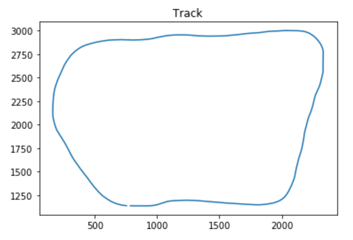
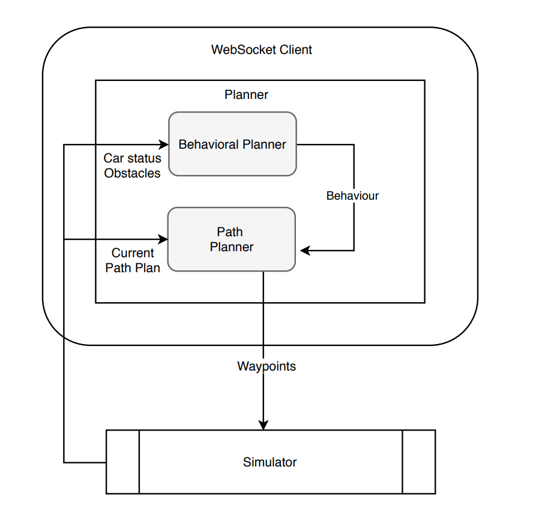

# Motion Path Planning
## Highway Driving
Self-Driving Car Engineer Nanodegree Program

By: [Eqbal Eki](http://www.eqbalq.com)

### Overview 

The goal of this project is to implement a path planning system which can safely navigate around a virtual highway with other traffic that is driving +-10 MPH of the 50 MPH speed limit.

Path planning is an interesting problem. In essence, it’s the process of finding a safe, comfortable and efficient (in that order) path through a set of dynamic maneuverable objects to reach our goal.

Usually, if we want to find a route between a source and a destination, and we want to find the fastest / shortest path, there are tons of algorithms to do this: (ex: `Dijkstra’s`, `Breadth First Search`, `A*`, etc…).

However in a road scene, whether it be a highway or urban roads, one of the most important difference is that the scene is not static, so our planning needs to be a dynamic one too.

Note we need to track the other objects with Sensor Fusion(dynamic such as other cars, pedestrians, bikes, etc…., and static such as trees, curbs, lamp posts).

The planning algorithm makes use of States and Jerk Minimized Trajectories in Frenet space.


### Data

We should design a path planner for a ~`6.5km` long track goes in a circle and is filled by a random vehicles. Each vehicle travels at a random speed and avoids collisions with slower traffic by reducing speed or changing lanes.

Provided are waypoints along the track as well as synthetic localization and sensor fusion data sent from the simulator

In `./data` folder we can find `highway_map.csv` file which includes data in `X/Y` format world space coordinates as well as Frenet S/D. 

Sensor fusion data contains position and velocity information of the twelve closest vehicles in travel direction.

Check out the plot below which represent data in `X/Y` coordinates taken from `highway_map.csv`:


### Structure

- `Planner` class which encapsulates instances of `BehaviorPlanner` and `PathPlanner`. 

- `BehaviorPlanner` class which works with `Planner` to decode the WebSocket inputs to collect the current path plan, composed of a sequence of waypoints in global Cartesian coordinates `(x, y)`.

- `Car` class which has the current car State, composed of global Cartesian coordinates `(x, y)`, orientation `o`, Frenet coordinates `(s, d)`, speed `v` and current lane `index`.

- `Obstacles` class that containing the Cartesian and Frenet coordinates, speeds and lane index of all vehicles on the same side of the road as the car. 

- `HighwayMap` class is used to keep track of all vehicles along the highway. 

### Notes

- Updated path plans are sent back to the simulator through the `WebSocket` interface.

- Because the Path Planner must react quickly to changing road conditions, the plan covers a period of only `0.3`s.

- Each turn the first 0.1s worth of waypoints from the current path plan is kept, and a new plan is constructed from the last kept waypoint onwards.

- The first step of the planning process is to update `Car` and `Obstacles` objects to reflect expected conditions 0.1s into the future.

- The `BehaviorPlanner` then updates its internal Finite State Machine (`FSM`) according to predicted readings and its own rules (illustrated in `FSM` section)

- The car uses a perfect controller and will visit every (x,y) point it receives in a list every .02 seconds.

### System Architecture & Flow

This project implements a `Planner` (composed of a `Behavior Planner` and a `Path Planner`) to create smooth, safe paths for an autonomous car to drive along.

It communicates with Udacity's simulator through a WebSocket interface, receiving as input:

- Car state
- Obstacle data
- Current path plan

And sending back a new sequence of waypoints describing the updated path plan. The diagram below summarizes the system architecture:



### FSM

The FSM starts at the START state, which determines the initial lane and the switches into the CRUISING state. In this state the car moves at the reference speed of 20m/s (close to 44MPH); it also tries to keep the car on the middle lane, from where it can more easily move to avoid slower cars. If it finds a slower car ahead, it initially switches to the TAILING state where it will try to pair its speed to them, while watching for an opportunity to change lanes. When this comes the FSM selects a destination lane and switches to CHANGING_LANES state, returning to CRUISING state once the movement is complete.

Once the current behavior (composed of a reference speed v and a polynomial route roughly indicating whether to keep or change lanes) is determined, it's dispatched along the current State to the PathPlanner. It in turn uses the CppAD interface to Ipopt to compute a sequence of waypoints approaching the route at the reference speed, while respecting acceleration limits.

  
### Simulator
You can download the Term3 Simulator which contains the Path Planning Project from the [releases tab (https://github.com/udacity/self-driving-car-sim/releases).

### Goals
In this project your goal is to safely navigate around a virtual highway with other traffic that is driving +-10 MPH of the 50 MPH speed limit. You will be provided the car's localization and sensor fusion data, there is also a sparse map list of waypoints around the highway. The car should try to go as close as possible to the 50 MPH speed limit, which means passing slower traffic when possible, note that other cars will try to change lanes too. The car should avoid hitting other cars at all cost as well as driving inside of the marked road lanes at all times, unless going from one lane to another. The car should be able to make one complete loop around the 6946m highway. Since the car is trying to go 50 MPH, it should take a little over 5 minutes to complete 1 loop. Also the car should not experience total acceleration over 10 m/s^2 and jerk that is greater than 50 m/s^3.

#### The map of the highway is in data/highway_map.txt
Each waypoint in the list contains  [x,y,s,dx,dy] values. x and y are the waypoint's map coordinate position, the s value is the distance along the road to get to that waypoint in meters, the dx and dy values define the unit normal vector pointing outward of the highway loop.

The highway's waypoints loop around so the frenet s value, distance along the road, goes from 0 to 6945.554.

## Basic Build Instructions

1. Clone this repo.
2. Make a build directory: `mkdir build && cd build`
3. Compile: `cmake .. && make`
4. Run it: `./path_planning`.

Here is the data provided from the Simulator to the C++ Program

#### Main car's localization Data (No Noise)

["x"] The car's x position in map coordinates

["y"] The car's y position in map coordinates

["s"] The car's s position in frenet coordinates

["d"] The car's d position in frenet coordinates

["yaw"] The car's yaw angle in the map

["speed"] The car's speed in MPH

#### Previous path data given to the Planner

//Note: Return the previous list but with processed points removed, can be a nice tool to show how far along
the path has processed since last time. 

["previous_path_x"] The previous list of x points previously given to the simulator

["previous_path_y"] The previous list of y points previously given to the simulator

#### Previous path's end s and d values 

["end_path_s"] The previous list's last point's frenet s value

["end_path_d"] The previous list's last point's frenet d value

#### Sensor Fusion Data, a list of all other car's attributes on the same side of the road. (No Noise)

["sensor_fusion"] A 2d vector of cars and then that car's [car's unique ID, car's x position in map coordinates, car's y position in map coordinates, car's x velocity in m/s, car's y velocity in m/s, car's s position in frenet coordinates, car's d position in frenet coordinates. 

## Details

1. The car uses a perfect controller and will visit every (x,y) point it recieves in the list every .02 seconds. The units for the (x,y) points are in meters and the spacing of the points determines the speed of the car. The vector going from a point to the next point in the list dictates the angle of the car. Acceleration both in the tangential and normal directions is measured along with the jerk, the rate of change of total Acceleration. The (x,y) point paths that the planner recieves should not have a total acceleration that goes over 10 m/s^2, also the jerk should not go over 50 m/s^3. (NOTE: As this is BETA, these requirements might change. Also currently jerk is over a .02 second interval, it would probably be better to average total acceleration over 1 second and measure jerk from that.

2. There will be some latency between the simulator running and the path planner returning a path, with optimized code usually its not very long maybe just 1-3 time steps. During this delay the simulator will continue using points that it was last given, because of this its a good idea to store the last points you have used so you can have a smooth transition. previous_path_x, and previous_path_y can be helpful for this transition since they show the last points given to the simulator controller with the processed points already removed. You would either return a path that extends this previous path or make sure to create a new path that has a smooth transition with this last path.

## Tips

A really helpful resource for doing this project and creating smooth trajectories was using http://kluge.in-chemnitz.de/opensource/spline/, the spline function is in a single hearder file is really easy to use.

---

## Dependencies

* cmake >= 3.5
 * All OSes: [click here for installation instructions](https://cmake.org/install/)
* make >= 4.1
  * Linux: make is installed by default on most Linux distros
  * Mac: [install Xcode command line tools to get make](https://developer.apple.com/xcode/features/)
  * Windows: [Click here for installation instructions](http://gnuwin32.sourceforge.net/packages/make.htm)
* gcc/g++ >= 5.4
  * Linux: gcc / g++ is installed by default on most Linux distros
  * Mac: same deal as make - [install Xcode command line tools]((https://developer.apple.com/xcode/features/)
  * Windows: recommend using [MinGW](http://www.mingw.org/)
* [uWebSockets](https://github.com/uWebSockets/uWebSockets)
  * Run either `install-mac.sh` or `install-ubuntu.sh`.
  * If you install from source, checkout to commit `e94b6e1`, i.e.
    ```
    git clone https://github.com/uWebSockets/uWebSockets 
    cd uWebSockets
    git checkout e94b6e1
    ```

## Editor Settings

We've purposefully kept editor configuration files out of this repo in order to
keep it as simple and environment agnostic as possible. However, we recommend
using the following settings:

* indent using spaces
* set tab width to 2 spaces (keeps the matrices in source code aligned)

## Code Style

Please (do your best to) stick to [Google's C++ style guide](https://google.github.io/styleguide/cppguide.html).

## Project Instructions and Rubric

Note: regardless of the changes you make, your project must be buildable using
cmake and make!


## Call for IDE Profiles Pull Requests

Help your fellow students!

We decided to create Makefiles with cmake to keep this project as platform
agnostic as possible. Similarly, we omitted IDE profiles in order to ensure
that students don't feel pressured to use one IDE or another.

However! I'd love to help people get up and running with their IDEs of choice.
If you've created a profile for an IDE that you think other students would
appreciate, we'd love to have you add the requisite profile files and
instructions to ide_profiles/. For example if you wanted to add a VS Code
profile, you'd add:

* /ide_profiles/vscode/.vscode
* /ide_profiles/vscode/README.md

The README should explain what the profile does, how to take advantage of it,
and how to install it.

Frankly, I've never been involved in a project with multiple IDE profiles
before. I believe the best way to handle this would be to keep them out of the
repo root to avoid clutter. My expectation is that most profiles will include
instructions to copy files to a new location to get picked up by the IDE, but
that's just a guess.

One last note here: regardless of the IDE used, every submitted project must
still be compilable with cmake and make./
